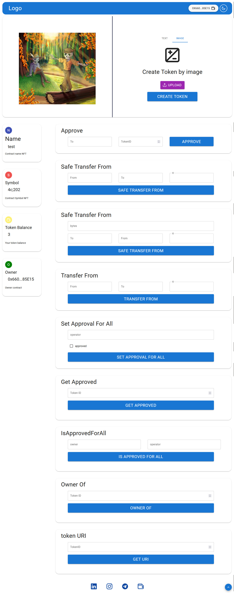
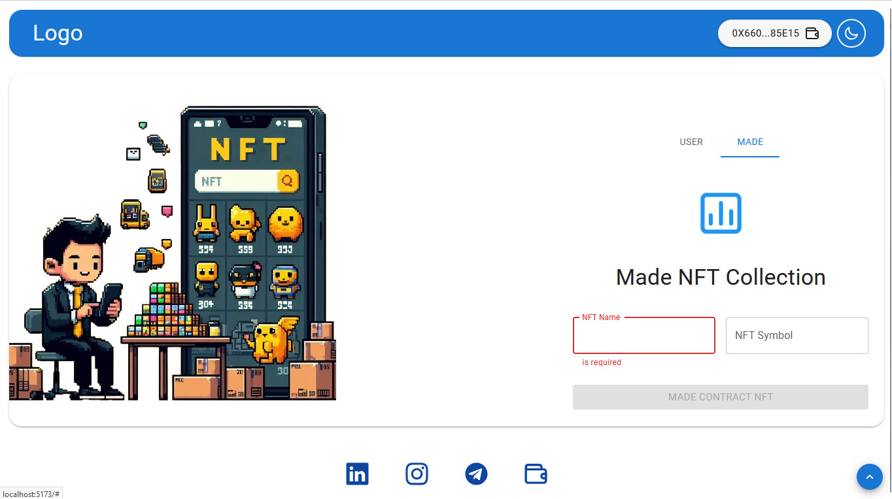

# NFT Generator


## Overview

This project is an NFT Generator that allows users to create, manage, and interact with their own NFT collections. The DApp includes functionalities for generating NFTs, managing collections, and performing various NFT-related operations.

## Features

- **NFT Generation**: Generate unique NFTs with customizable attributes and metadata.
- **Collection Management**: Create and manage multiple NFT collections.
- **Minting**: Mint NFTs directly from the DApp.
- **Metadata Storage**: Store NFT metadata on IPFS.
- **User Authentication**: Secure user authentication using MetaMask.
- **Smart Contract Interaction**: Interact with smart contracts on the Ethereum blockchain.

## Installation

1. **Clone the repository**:

   ```bash
   git clone https://github.com/mahdiZarrei/nft-generator.git
   cd nft-generator
   ```

2. **Install dependencies**:
   ```bash
   npm install
   ```
3. **Run the DApp**:
   ```bash
   npm run dev
   ```

## Usage

1. **Connect Wallet**: Connect your MetaMask wallet to the DApp.
2. **Generate NFT**: Use the NFT generator tool to create unique NFTs.
3. **Mint NFT**: Mint the generated NFTs to your wallet.
4. **Manage Collection**: View and manage your NFT collections.

## Smart Contracts

The smart contract for this project are written in Solidity and deployed on the Ethereum blockchain. You can find the contract code in the `contract` directory.

## Contributing

Contributions are welcome! Please fork the repository and create a pull request with your changes.

## License

This project is licensed under the MIT License. See the `LICENSE` file for more details.

## Photo gallery

### NFT page



### login page


